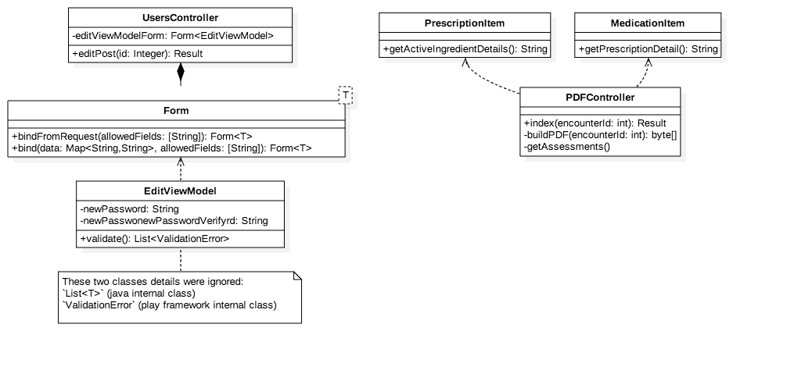
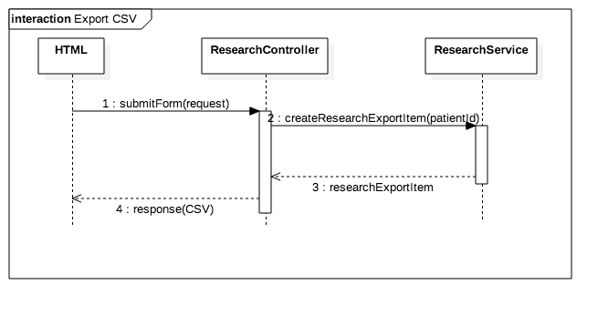

# Change Request Log

## Team: Group 1

txz150730 - Tianxiang Zhang  
zxq150130 - Zengtai Qi (Shane)

## Change Request: FEMR-208

Description:  
The generated PDF is not displaying the amount of a prescription that was dispensed.  

1. Create a new patient in Triage
2. Prescribe them some medications in Medical. Make sure the amount is > 0
3. Dispense the prescriptions in Pharmacy (click Submit)
4. View the patients encounter summary by pulling their ID up in Triage and clicking "Patient History" on the bottom.
5. Select the encounter where the prescription was dispensed on the right. The dispensed prescription is displayed here with the amount.
6. Click the red "Generate PDF" button. The dispensed prescription is displayed here, but without the amount.

## Concept Location

\# | Description | Rationale
---|---|---
1 | We ran the system. |
2 | According to steps in the issue description (also refered to TA's email), we reproduced the problem in the localhost website. | In order to locate the page of the problem that the change request talks about.
3 |The steps are following: assigning the user to a trip, creating new prescription with enough inventory, creating a new patient and prescribing the patient some medicine we created before, dispensing the prescription in pharmacy and then fetching the patient history so we can click `generate PDF` to print out the pdf.|
4 |Accoring to the page uri (`history/encounter/####`), we understood what the format/template of prescription table should be.|We need to have a formal format to demonstrate the amount of medicine so that it is readable and understandable. If there is no such template found elsewhere, we would add a column called quantity between Original and Replaced.
5 | According to the page uri (`history/encounter/####`), we located the 'Generate PDF' button in file: `./app/femr/ui/views/history/indexEncounter.scala` | In order the find out which class in responsive for generating pdf.
6 | We looked into the html, find out this button goes into method `Result index(int encounterId)` of class `PDFController`. | In order to find out code about generating PDF.
7 | Method `Result index(int encounterId)` does an internal call to method `byte[] buildPDF(int encounterId)`, we went to this private method via shorcut 'Command + Left Click' | We wanted to track back to those code that generates directly.
8 | Method `byte[] buildPDF(int encounterId)` makes a lot of internal calls, we decided to use 'Find' tool with keywords 'Origin' (table head of generated pdf). | According to experience of change request 1, keywords in pdf are possibly hard-coded.
9 | We successfully find out the code of generating pdf in the method `PdfPTable getAssessments(TabFieldMultiMap tabFieldMultiMap, List<PrescriptionItem> prescriptionItems , List<ProblemItem> problemItems)` of class `PDFController`. And we marked this class and method. |
10 | We looked into this method and found out that this method is only responsible for generating the prescription table but it output only the name of the prescription without the amount of it |
11 | We searched the whole project with key word `Dispensed Medication` which is presented on the `history/encounter/####` page. And it returned there are two appearances, `IndexEncounter.scala.html` and `IndexEncounter.template.scala`. | Since page `history/encounter/####` has the information of medicine name, amount and value per unit, we want to figure out where this kind of information is stored and where it goes to.
12 | We picked `IndexEncounter.scala.html` to analyze and figured out all the data in the table are from `prescription` object, which is returned from `ViewModelPharmacy`’s `getPrescriptions()` mehod. | `IndexEncounter.template.scala` has only formatting things so we did not bother reading it.
13 | We used 'Command + left click' and find out that `ViewModelPharmacy` is actually an `IndexEncounterPharmacyViewModel` object which has a data field of a list of `PrescriptionItem` objects.|
14 | Then we analyzed the `Generate PDF` button and found out that the code pushed all information from those mentioned objects to `PDFController` though `PDFController` did not have the code to print out the amount. |
15 | We went to `PDFController.java` and tried if each `prescriptionItem` has a list of `activeDrug`. As expected, it does.|`IndexEncounter.scala.html` indicates that for each prescription item, it stores a list of activedurg type objects which contain active drug name, value and unit inside.
16 | We decide to start a new method in `ActiveIngredient` to return the `activeIngredient` object’s name,value and unit by formatted string and marked it changed.| Since any change about the prescription itself is not logically related to `PDFController`, so we decided to move on to `prescriptionItem` to see if it is the first class to change. And the answer is no because it has a data field which is a list of `activeIngredient` type. So we looked in to the `activeIngredient` and considered to add a method to return the detailed information. And hence all the details can be returned by a for loop operating on the `activeIngredient` list.

__Time Spent: 40 mins__  
__Recorder: Tianxiang Zhang__

## Impact Analysis

Use the table below to describe each step you followed when performing impact analysis for this change request. Include as many details as possible, including why classes are visited or why they are discarded from the ones that have to change.
Do not take the impact analysis of your changes lightly. Remember that any small change in the code could lead to large changes in the behavior of the system. Follow the process on impact analysis covered in the class. Describe in details how you followed this process in the change request log. Provide details on how and why you finished the impact analysis process.

\# | Description | Rationale
---|---|---
1 | We made a breakpoint around code of generating prescription items table and generated a pdf again. | In order to know how the button click event goes all the way to the code, and how many classed/methods are involved.
2 | According to debug tool, we found out the impact set contains `Controller`, `PDFController.getAssessments()`, `PrescriptionItem`, `MedicationItem`, `ActiveIngredient`, `IndexEncounterPharmacyViewModel`. And we marked `ActiveIngredient` __CHANGED__, Others as __NEXT__.  | In order to have a list of what could be impacted by the change. And classes called before Routes class are about the framework which we don't have to pay attention.
3 | The chain is `PDFController.getAssessments()` -> `PrescriptionItem`  -> `MedicationItem` -> `ActiveIngredient`. |We have the invocation chain here and according to the chain, the next class or method we touched was `PrescriptionItem`.
4 |We walked into the `ActiveIngredient` class which is nested inside` MeidcationItem` class and decided there could be a new method called `getActiveIngredientDetails()` which will return the whole roster of active ingredients as well as their unit. Then we marked `ActiveIngredient` and `MedicationItem` __CHANGED__. |
5 | We define the above change is small and not risky to the whole system.| Since it is just a new method which does not modify data but just output data as a long string. The method and the change will never hurt the content of the project.
6 | We looked into the `Prescription`, and we decide to add a new method called `getPrescriptionDetail()` which will return the concatenated information of the amount and name of the prescription as well as all active ingredients information by calling the method we set in `ActiveIngredient` class. Then we mark PrescriptionItem __CHANGED__. |
7 | We define the above change is small and not risky to the whole system. |Since it is just a new method which does not modify data but just output data as a long string. The method and the change will never hurt the content of the project.
8 | Next, we went back to `getAssessment()`. The table cell receives data from `getName()` or `getOriginalMedName()` method, so we need to replace this method by `getPrescriptionDetail()` in the for loop, which then would generate table cells with more information instead of only the name solely, thus `getAssessments()` and `PDFController` were marked as __CHANGED__.   |
9 | Again, for the same reason we define the above change is small and not risky to the whole system. |
10 | We marked `Controller` __UNCHANGED__.| `PDFController` is extended from `Controller` and we checked out `Controller` class, there is nothing involved in the prescription table task.
11 | We marked `IndexEcnounterPharmacyViewModel` __UNCHANGED__.| Since this class is related to patient input only, we don’t need to change it.

__Time spent: 30 mins__
__Recorder: Tianxiang Zhang__

## Prefactoring

\# | Description | Rationale
---|---|---
1 | We would only add some methods that output current data field, so there would be no big changes nor anything that would change any kind of current data structure or utility of a certain method. |
2 | We decided to skip refactoring. |

__Time Spent: 10 mins__  
__Recorder: Tianxiang Zhang__

## Actualization

\# | Description | Rationale
---|---|---
1 | We walked into the `ActiveIngredient` class which is nested inside MeidcationItem class, and we figured out that there are several data fields that are desired by us, including `name`, `value` and `unit`. Thus we added a new method called `getActiveIngredientDetails()` which returns the name of the active ingredient as well as its unit. i.e. `return name + value + unit`. | To make a project looks logically clear, adding a new `get` method in `ActiveIngredient` class is better than accessing a lot of `ActiveIngredient` data fields and print them out in `PrescriptionItem` class. The previous solution demonstrated an integrity in logic, i.e. the detail of `ActiveIngredient` and `ActiveIngredient` class is more logically related than it and the `PrescriptionItem`.
2 | Then we went inside `PrescriptionItem` class, adding a new method called `getPrescriptionDetail()` that will return the prescription amount, name and form (tabs, MDI etc) as well as the full roster of the active ingredient information. |
3 | To implement step 2, we need to divide it into two parts.  First, we found out the prescription name, unit and form simply by the data field `name`, `unit` and `medicationForm`. Then we set up a for loop that would operate on the `medicationActiveDrugs` list which contains all the active ingredients inside this prescription. For each legit active ingredient, we call the `getActiveIngredientDetails()` and thus all of them will be concatenated as a whole string together with the prescription name, form and unit.|
4 | Last but not least, we noticed that during the producing of table cells, only `getName()` was called and we need to replace it with our newly added method `getPrescriptionDetail()` to return all the data we fetched from related objects, including the prescription’s name as well.|

__Time Spent: 30 mins__  
__Recorder: Tianxiang Zhang__

## Postfactoring

\# | Description | Rationale
---|---|---
1 | Skipped for this request | The thing we did to perform the change was adding methods that return some strings without changing any data fields or utilities. So the change is pretty small and involved with no structural issues.

__Time Spent: 10 mins__  
__Recorder: Tianxiang Zhang__

## Validation

\# | Description | Rationale
---|---|---
1 | Since we found out that most code under `test` directory was commented out, we asked the team via Slack for some clarification of unit tests. It turned out they had a long story of unit tests and they don't have a unit test environment for now. We decided to have more comprehensive tests from front end. |
2 | We re-ran the system. | Making sure change was applied to the system.
3 | Test case defined: Inputs: -10 days 50 Proventil 90 mcg albuterol (MDI) Expected output: “ 50 Proventil       90 mcg albuterol (MDI) “| Regular expected behavior test. The test passed.
4 | Test case defined: Inputs: -10 days 50 Custom prescription Test without active ingredient Expected output: “ 50 Test “| Exceptional behavior test. The test failed to perform, femr does not allow us to create a medicine without generic or the so-called active ingredient. So we’re good, this kind of exception will never happen.
5 | Test case defined: Inputs: -10 days 0 Proventil 90 mcg albuterol (MDI) Expected output: “ 0 Proventil       90 mcg albuterol (MDI) “| Exceptional behavior test. The test passed.
6 | Test case defined: Inputs: 10 days 1000 Proventil 90 mcg albuterol (MDI) -inventory for that kind of medicine is 100 Expected output: “ There should be some kind of warning regarding this problem. “|Exceptional behavior test. This test is actually testing not only the PDF but also the femr inventory system. It passed since the system prompted us that the inventory is not enough.

__Time Spent: 20 mins__  
__Recorder: Tianxiang Zhang__

## Timing

Phase Name | Time (minutes)
---|---
Concept Location | 40
Impact Analysis | 30
Prefactoring | 10
Actualization | 30
Postfactoring | 10
Validation | 20
Documentation (this log) | 100
Total | 240

__Recording Time Included__

## Reverse engineering

### Class Diagram

### Sequence Diagram

## Conclusions
For this change, the actualization part is respectively easier. It did not request much coding skill but just some understanding about OOP and the ability to code some basic string operation and thus we had millions of ways to make the change, i.g. directly created a new method under PDFController and call it in the `getAssessment()` method. But we understood that each method should be logically related to the class and abandoned this solution since the method that prints the prescription details is not relevant to `PDFController` thus it is preferred to be inside the priscriptionItem class. Hence, we took most time focusing on impact analysis and concept location. These two parts directed us to locate where the changes should be made without hurting the logical structure of the project.

After the change, we did some tests on the new utility. Since the change involved with only showing some strings and the femr system has already set many restrictions to make sure the amount and content of a prescription be legit, we don’t have many exceptional behavior test cases to test the new code, yet all the cases we could come up with passed.

Class and methods changed: 
- `App/femr/common/models/MedicationItem.java`  
`String getActiveIngredientDetails()`
- `App/femr/common/models/PrescriptionItem.java`  
	`String getPrescriptionDetails()`
- `App/femr/ui/controllers/PDFController.java`  
  `getAssessment()`
