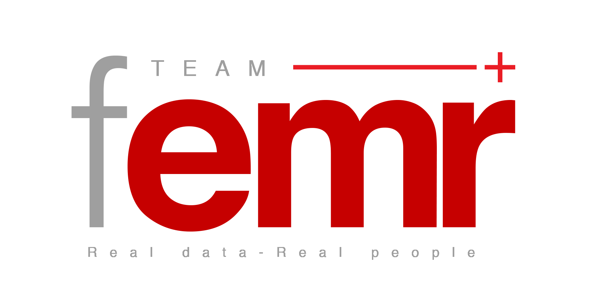
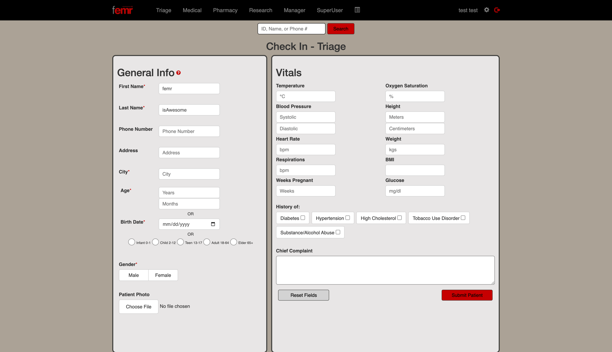
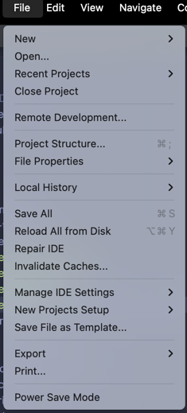
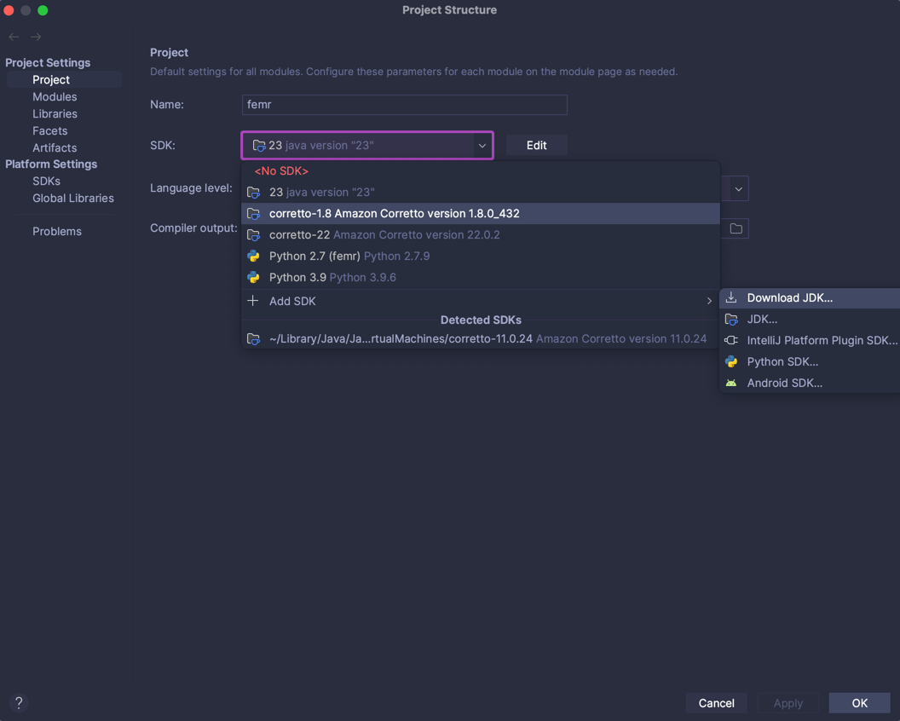
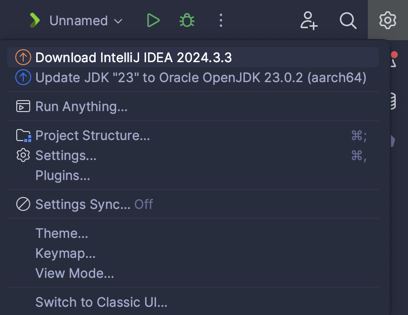
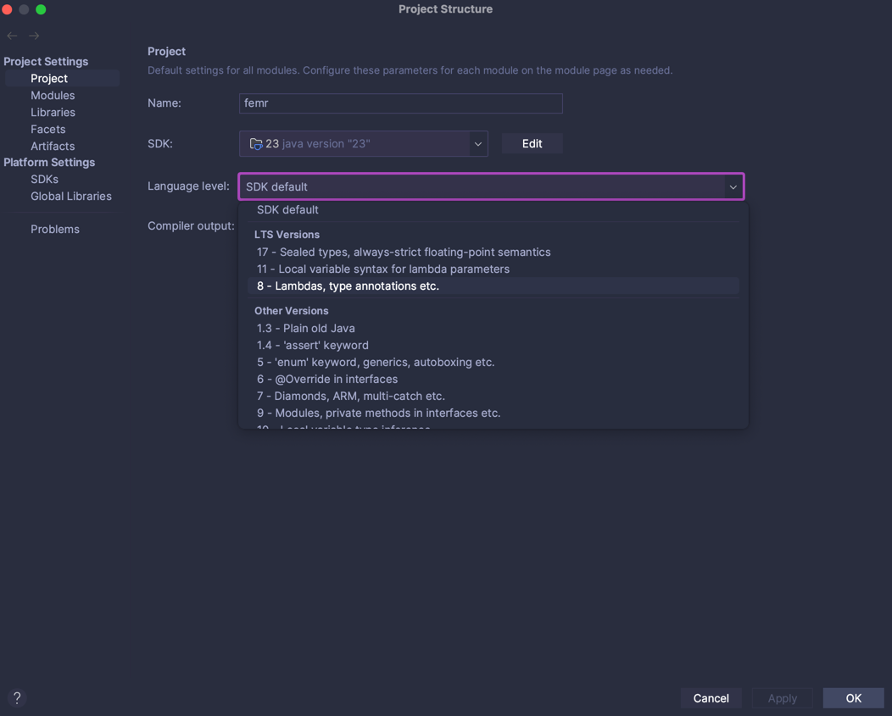
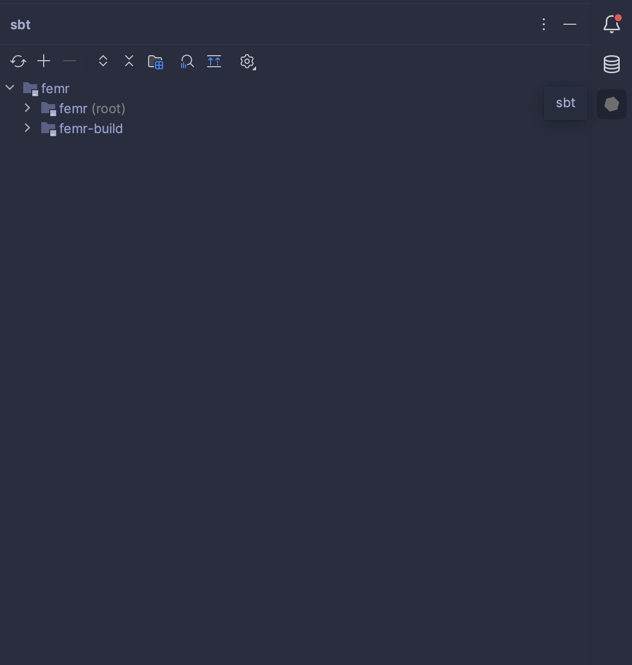

# FEMR - Fast Electronic Medical Records





### Description

fEMR is a fast EMR solution for remote clinics who depend on speed and ease of use rather than complex features. Check out [Team fEMR's website](https://teamfemr.org) for more information and a live demo.

### Community
1. [Slack](http://teamfemr.org/slack.html)
2. [JIRA](https://teamfemr.atlassian.net)
3. [Team FEMR](https://teamfemr.org)
4. [Confluence](https://calpoly-se-capstone.atlassian.net/wiki/spaces/fEMR/pages/45809675/START+HERE+What+is+fEMR)

### tEMR Community
1. [JIRA](https://platinum.cscaws.com:8443/projects/TEMR/summary)
2. [Cal Poly JIRA](https://calpoly-se-capstone.atlassian.net/jira/software/projects/FEMR/summary)

### Dependencies

* [Play Framework](http://www.playframework.com/)

### Contributing
For more information on contributing, please see the CONTRIBUTING.md file. For details regarding installation and deployment, continue reading.

### CI
This repo uses Github Actions workflows for continuous integration, which can be found under the [Actions tab in Github](https://github.com/CPSECapstone/zzs-femr/actions?query=workflow%3A%22Scala+CI%22). The Scala CI workflow runs 'sbt test' whenever code is pushed or a pull request is made to the main branch. When a pull request is submitted to master, a Docker image is built for testing purposes. On a successful merge with master, the docker image will be published to [dockerhub](https://hub.docker.com/r/teamfemrdev/teamfemr).

### Setting up weekly backup reminder

* It is very important for the administrator to backup local data to the remote database.
* A cronjob can be set up before a kit is deployed to automatically display a message once a week.

1. In the command line, type crontab -e
2. A text editor should appear.
3. Add the following line to this file: 0 11 * * 5 <path to fEMR project home directory>/util/WeeklyReminder.sh
4. This will display a reminder pop up at 11:00AM every Friday.

### Warnings

* fEMR is not HIPAA compliant (... yet).
* fEMR is not meant to diagnose, treat, cure or prevent disease.
* fEMR may attempt to establish a secure remote connection when internet access becomes available. This behavior is configurable and turned off by default.

### Questions?

Email: kevin.zurek@teamfemr.org

## Running the application using Docker
1. Make sure you have [Docker](https://docs.docker.com/get-docker/) installed and running on your machine.
2. Clone the [FEMR/femr](https://github.com/FEMR/femr) repo: `git clone https://github.com/FEMR/femr.git`
3. Checkout the [master](https://github.com/FEMR/femr/tree/master) branch: `git checkout master`.
4. Cd into the femr directory: `cd femr`    
5. Run `docker-compose up` to start the app.
6. If step 5 successfully finishes, then the app will be available at http://localhost:9000/
    
# Setting up the project with IntelliJ on macOS and Windows

### Step 1: Download and Install the following Software and Dependencies 
- [IntelliJ IDEA Ultimate](https://www.jetbrains.com/idea/download/)
- [Docker Desktop](https://www.docker.com/products/docker-desktop/)
- [Git](http://git-scm.com/)

### Step 2: Clone the repo
- `git clone https://github.com/FEMR/femr.git`

### Step 3: Setting up the DB 
1. Ensure Docker Desktop is running
2. Open a terminal at the repository root
3. Run `docker-compose up db` to bring up the database. To stop the database use Ctrl+c

### Step 4: Configuring IntelliJ

1. Open IntelliJ IDEA Ultimate. Then open the `femr` project with `master` branch checked out.

2. In IntelliJ IDEA Ultimate and go to `Preferences` -> `Plugins` -> click `Marketplace` -> Then download `Scala` and `Play Framework`. Then restart the IDE.

3. Inside `femr/conf` folder, create a new file named  `application.dev.conf`. 

```
include "application.conf"
settings.researchOnly=0
db.default.url="jdbc:mysql://127.0.0.1:3306/femr_db?characterEncoding=UTF-8&useSSL=false&allowPublicKeyRetrieval=true"
db.default.username="femr"
db.default.password="password"
photos.defaultProfilePhoto="./public/img/defaultProfile.png"
csv.path="./Upload/CSV"
```

4. Go to `Run` -> `Edit Configurations` -> click on the `+` sign -> `Play 2 App`.
   - If `Play 2 App` doesn't appear, try restarting the IDE.

5. In the JVM options of the configuration add `-Dconfig.resource=application.dev.conf` to the end.


6. Go to `File` -> `Project structure` -> Under the `Project` tab -> Select `Project SDK` and set it to 1.8. 
    - You can download 1.8 directly from IntelliJ. If so, choose 1.8 Amazon Correto.

<details> <summary> screenshot </summary>




</details>

7. Change the language level to 8.

<details> <summary> screenshot </summary>




</details>

8. On the rightmost side of IntelliJ, if there is a vertical line containing sbt. Click on the sbt tab and then click the refresh symbol.
      - If there isn’t sbt on the right, remove the .idea folder from the root directory of the project. In the command line, traverse to the root directory and do: rm -r .idea. Then redo step 2 and then continue. If still does not work try invaliadating IntelliJ's cache.

<details> <summary> screenshot </summary>



</details>

9. After that runs, click on the Play button to run the configuration. If everything was set up correctly, the website should open up on another window. Select “Apply this script now”.

<details> <summary> screenshot </summary>


</details>

### Troubleshooting
1. Try deleting the .idea folder and rerunning sbt 
2. Confirm you have the absolute path in your environment variables
3. Try to re-apply the plugins Scala and Play Framework
4. Otherwise, try cloning the femr github and going through the steps once more.
5. Try invalidating Intellij IDEA cache.

### [EULA and Privacy Policy](https://github.com/FEMR/femr/blob/master/LICENSE)

